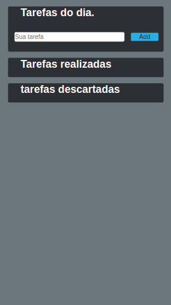

## Lista de Tarefas.

Consiste em uma aplicação simples onde o usuario pode cadastrar suas tarefas, marca-las como resolvidas ou até mesmo descarta-las se necessario, tendo o retorno da data em que foram executadas ou descartadas.

### Tecnologia utilizada.

  * Angular

  *Biblioteca:* [Moment](https://www.npmjs.com/package/moment), responsavel por formatar a data e hora.

### Resultado da tela.

